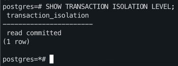
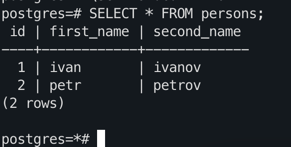
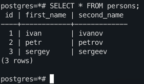
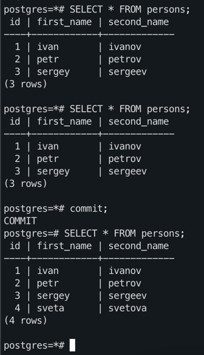

## Шаг 1: Запуск двух конкурентных сессий и подготовка
- Запуск двух сессий на ВМ запущенной в yandex cloud
```bash
docker exec -it pg15 psql -U postgres
```
- Отключение `auto commit`
```bash
\set AUTOCOMMIT off
```
- Заполнение данными
```sql
create table persons(id serial, first_name text, second_name text); 
insert into persons(first_name, second_name) values('ivan', 'ivanov'); 
insert into persons(first_name, second_name) values('petr', 'petrov'); 
commit;
```

## Шаг 2: Read commited

- Проверяем текущий уровень транзакции в сессиях



- Добавляем запись в первой сессии
```sql
insert into persons(first_name, second_name) 
values('sergey', 'sergeev');
```
Во второй сесси мы эту запись не видим, так как в PG для этого уровня мы должны видеть только закоммиченные изменения.
При этом уровень read uncommited не поддерживается в PG



После коммита в первой сессии мы увидим изменения во второй сессии. Именно это и обеспечивает наш уровень транзакции.



## Шаг 3: Repeatable read

- Запускаем транзакции с уровнем repeatable read:

```bash
BEGIN TRANSACTION ISOLATION LEVEL REPEATABLE READ;
```

- Добавляем запись в первой сессии:
```sql
insert into persons(first_name, second_name) 
values('sveta', 'svetova');
```

Во второй сессии мы эту запись не видим по тем же самым причинам, изменения незакоммичены.

Если сделать коммит в первой сессии то мы опять не увидим эти данные во второй сессии.
Это обеспечивается уровнем изоляции, все селекты должны видеть один и тотже снэпшот данных.

После коммита в рамках второй сессии мы уже увидим изменения в селекте.
Так как теперь работаем с новым снэпшотом


