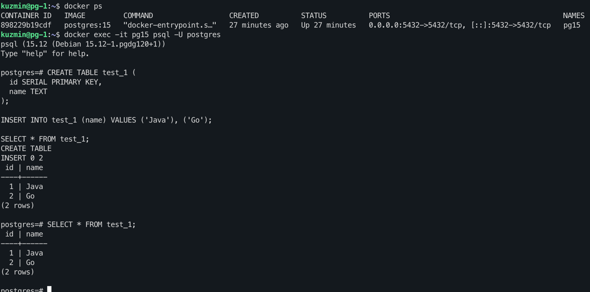
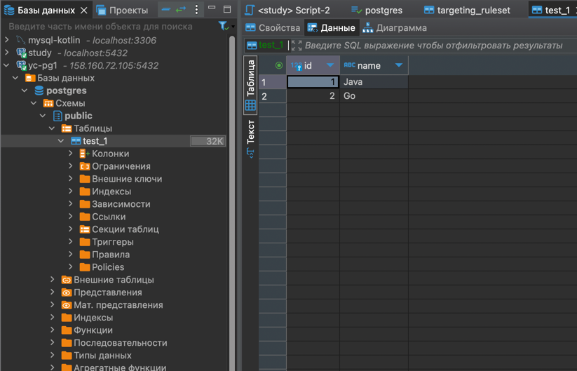
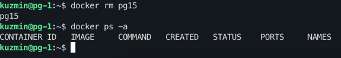

## Шаг 1: Развёртывание окружения в облаке
- Развёрнута виртуальная машина в Яндекс.Облаке
- На виртуалке установлен Docker

## Шаг 2: Запуск PostgreSQL в Docker

- Создан каталог для хранения данных PostgreSQL: `/var/lib/postgres`
- Выполнен запуск контейнера с PostgreSQL 15:

```bash
docker run -d \
  --name pg15 \
  -e POSTGRES_PASSWORD=secret \
  -v /var/lib/postgres:/var/lib/postgresql/data \
  -p 5432:5432 \
  postgres:15
```

## Шаг 3: Работа с БД через `docker exec`

- Выполнено подключение к PostgreSQL `pg15` через консольную утилиту :

```bash
docker exec -it pg15 psql -U postgres
```

- Создана тестовая таблица и добавлены строки:
```sql
CREATE TABLE test_1 (
  id SERIAL PRIMARY KEY,
  name TEXT
);

INSERT INTO test_1 (name) VALUES ('Java'), ('Go');

SELECT * FROM test_1;
```

- Вывод в консоли:



## Шаг 4: Работа с БД через `dbeaver`

- Настроено подключение через GUI
- В интерфейсе видно, что база содержит схему public и таблицу test_1
- Проверка показала доступность базы и таблиц из внешней среды




## Шаг 5: Перезапуск контейнера и проверка сохранности данных

- Останавливаем и удаляем контейнер pg15:
```bash
docker stop pg15
docker rm pg15
```
- Убеждаемся в отсутствии контейнера:
```bash
docker ps -a
```


- Контейнер запущен повторно с теми же параметрами, монтируя прежний volume:
```bash
docker run -d \
  --name pg15 \
  -e POSTGRES_PASSWORD=secret \
  -v /var/lib/postgres:/var/lib/postgresql/data \
  -p 5432:5432 \
  postgres:15
```

- Повторная проверка показала доступность базы и таблиц из внешней среды