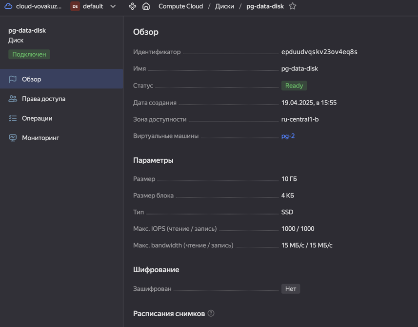
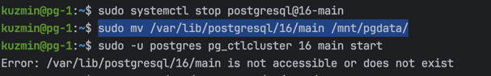
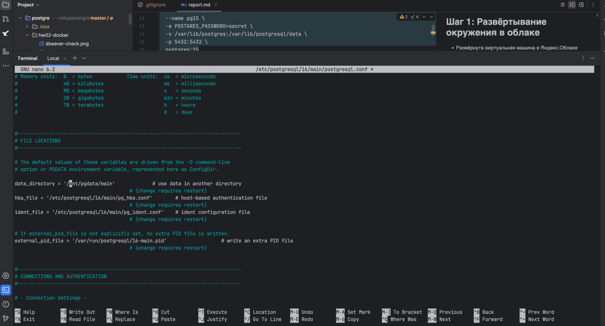
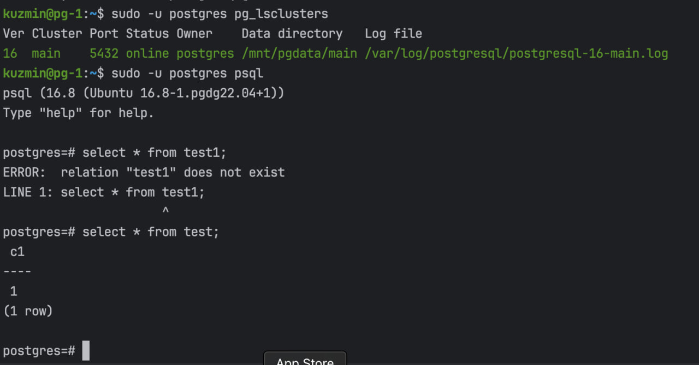
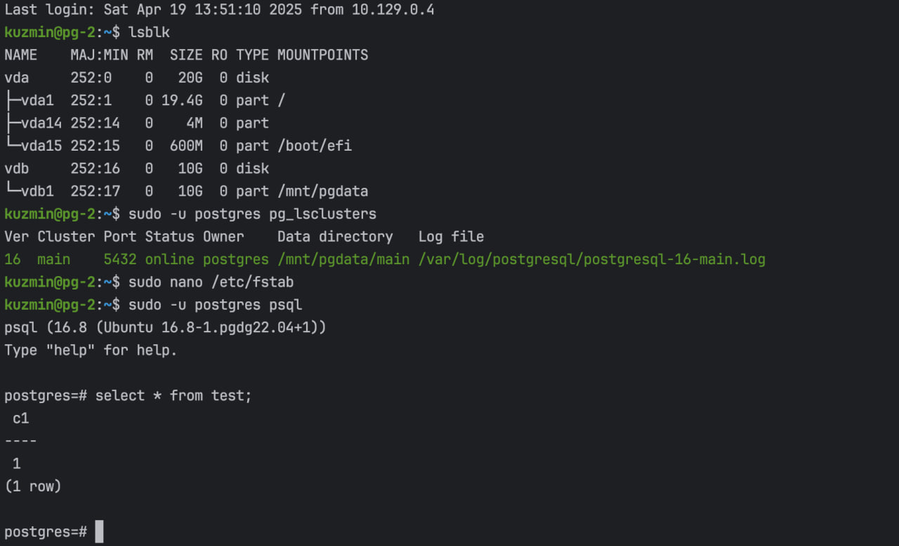

## Шаг 1: Установка PostgreSQL в облаке
- Развёрнута виртуальная машина pg-1 в Яндекс.Облаке
- Установлен pg16 через sudo apt

## Шаг 2: Проверка и вставка тестовых данных

- Выполнено подключение через утилиту:
```bash
sudo -u postgres psql
```

- Создана тестовая таблица и добавлены строки:
```sql
create table test(c1 text);

insert into test values('1');
```

- Остановка пг кластера:
```bash
sudo -u postgres pg_ctlcluster 16 main stop
```

## Шаг 3: Добавление внешнего диска

- В облаке был создан и присоединен дополнительный диск



- На вм он был подготовлен и смонтирован
- Туда были перенесены данные из pg и при попытке старта была ошибка


- Причина заключается в том что главный конфигурационный файл постгреса не был скорректирован.
- После этого поправили postgresql.conf



```bash
sudo -u postgres pg_ctlcluster 15 main stop
```

- После этого уже успешный старт



## Шаг 4: Новый инстанс `pg-2`

- Остановил кластер и демонтировал диск на первом инстансе
- Далее сделал снимок диска с `pg-1`
- Вторую вм `pg-2` создавал уже на основе этого снимка
- Присоединил диск `pg-data-disk` к второму инстансу
- Кластер пг успешно стартанул, монтирование произошло автоматически благодаря `fstab`


