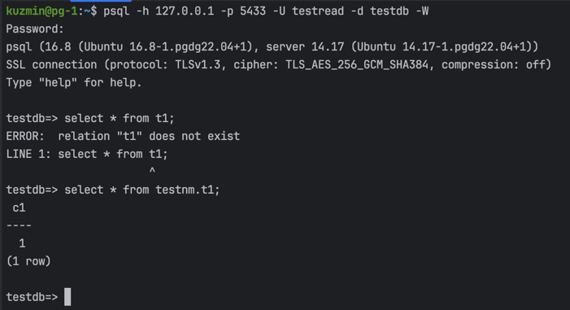

## Шаг 1: Создание роли и юзера
- Произведены все подготовительные действия
- Созданы база данных, схема, данные, роль


- Создан юзер и наделен правами
```bash
testdb=# CREATE ROLE testread WITH LOGIN PASSWORD 'test123';
testdb=# GRANT readonly TO testread;
```
- Проверка доступа


- Проблемы могут возникнуть если создавать таблицу без указания схемы, тогда она будет создана в схему public, куда юзер не имеет доступа.

## Шаг 2: Установка дефолтной схемы для юзера

- Для того чтобы юзеру не надо было указывать схему `testnm` при обращении к таблицам:
```sql
ALTER ROLE testread SET search_path TO testnm;
```

- Попытки создания новых таблиц:
```bash
 create table t2(c1 integer);
```


- Тестовый юзер не может создавать таблицы как и ожидается