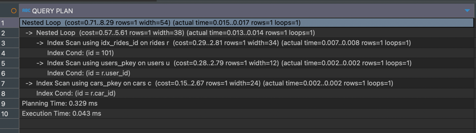
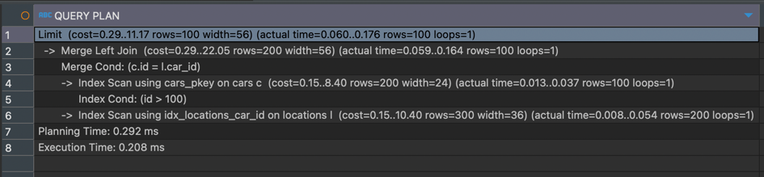
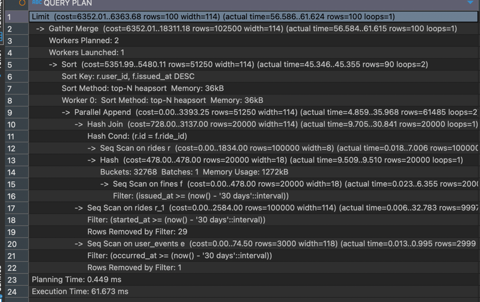
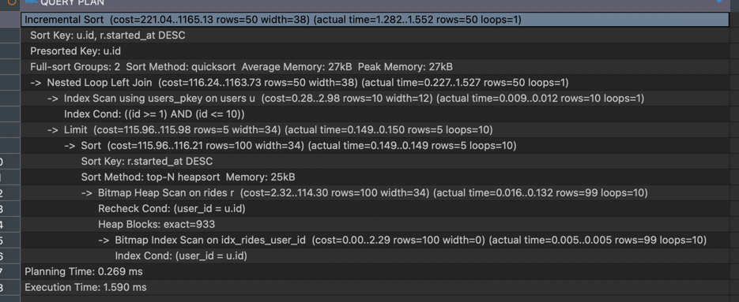
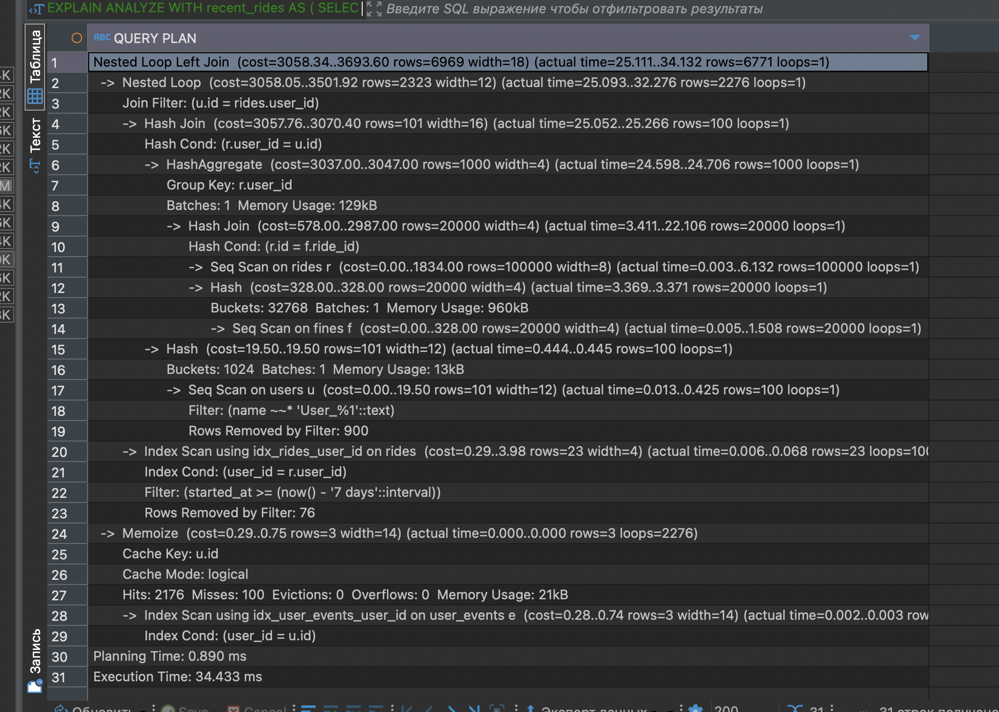

## Шаг 0: Подготовка тестовых данных и определение методики
Для моделирования был выбран домен каршеринга

Скрипт для инициализации сохранён в отдельном файле:
- [init.sql](./init.sql)

### Выбранная методика анализа

Для оценки каждого запроса будут использоваться **три метрики производительности**, критически важные для анализа поведения планировщика PostgreSQL:

1. **Тип используемого соединения** (`Hash Join`, `Merge Join`, `Nested Loop`)
2. **Наличие последовательного чтения** (`Seq Scan`)

Эти метрики отражают ключевые аспекты:
- способности запроса масштабироваться,
- использования индексов и кэширования,
- поведения планировщика на больших объёмах данных.

### Вариативность исполнения запросов

Для некоторых джойнов рассмотрим **несколько вариантов** исполнения:
- **С использованием индексируемых условий**
- **Без условий**
- **С дополнительными фильтрами (`WHERE`)**

Это позволит:
- выявить влияние фильтрации на план запроса,
- отследить переключение между типами соединений (например, `Nested Loop` → `Hash Join`),
- исследовать, как PostgreSQL ведёт себя при работе с небольшими и умеренными объёмами данных.

## Шаг 1: Join прямое соединие

### Базовый запрос. Список поездок с именем пользователя и моделью автомобиля
```sql
SELECT
   r.id AS ride_id,
   u.name AS user_name,
   c.model AS car_model,
   r.started_at,
   r.ended_at,
   r.distance_km
FROM rides r
JOIN users u ON r.user_id = u.id
JOIN cars c ON r.car_id = c.id;
```

Метрики анализа:

| Метрика                                 | Значение                     | Комментарий                                      |
|----------------------------------------|------------------------------|--------------------------------------------------|
| Тип соединения (`JOIN TYPE`)           | `Hash Join ×2`               | Идеально для таких объёмов и без условий         |
| Последовательное чтение (`Seq Scan`)   | `rides`, `users`, `cars`     | Ожидаемо: полное сканирование без индексов       |

---

Планировщик:

- `rides` читается последовательно: `Seq Scan on rides`
- `users` и `cars` попадают в `Hash`, используются в `Hash Join`
- `Execution Time`: `~45 ms` на 100k строк


### С выборкой по id
```sql
SELECT
   r.id AS ride_id,
   r.started_at,
   r.ended_at,
   r.distance_km,
   u.name AS user_name,
   c.model AS car_model,
   c.status AS car_status
FROM rides r
JOIN users u ON r.user_id = u.id
JOIN cars c ON r.car_id = c.id
WHERE r.id IN (
   101
   );
```



Метрики анализа:

| Метрика                                 | Значение                   | Комментарий                                      |
|----------------------------------------|----------------------------|--------------------------------------------------|
| Тип соединения (`JOIN TYPE`)           | `Nested Loop ×2`           | Идеально подходит для точечного доступа по PK    |
| Последовательное чтение (`Seq Scan`)   | ❌ отсутствует              | Весь запрос выполнен по индексам                |

---

Планировщик:

- `rides` читается по `id = 101` через `Index Scan` (индекс `idx_rides_id`)
- `users` и `cars` подтягиваются по первичным ключам через `Index Scan`
- Все соединения реализованы как `Nested Loop`, т.к. каждая таблица выдаёт ровно по одной строке
- `Seq Scan` нигде не используется
- `Execution Time`: `~0.045 ms` — мгновенно, идеально для точечного запроса

## Шаг 2: Left join

### Получить список автомобилей с ID выше 100, включая информацию о текущем статусе и последней известной геолокации, отсортированных по ID
```sql
SELECT
   c.id AS car_id,
   c.model,
   c.status,
   l.updated_at AS last_location_time,
   l.lat,
   l.lon
FROM cars c
LEFT JOIN locations l ON l.car_id = c.id
WHERE c.id > 100
ORDER BY c.id
LIMIT 100;
```


Метрики анализа:

| Метрика                                 | Значение                        | Комментарий                                                       |
|----------------------------------------|---------------------------------|--------------------------------------------------------------------|
| Тип соединения (`JOIN TYPE`)           | `Merge Left Join`               | Использован за счёт упорядоченного `ORDER BY c.id`, обе стороны отсортированы |
| Последовательное чтение (`Seq Scan`)   | ❌ отсутствует                   | Использованы `Index Scan` на обеих таблицах                       |

---

Планировщик:

- `cars` читается через `Index Scan` с фильтром: `id > 100`
- `locations` читается по индексу `car_id`: `Index Scan using idx_locations_car_id`
- Соединение выполнено через `Merge Left Join`, т.к. обе таблицы отсортированы по `id`
- `LEFT JOIN` позволяет вывести даже те машины, у которых **нет локаций**
- `LIMIT 100` ограничивает результат после объединения
- `Execution Time`: `~0.2 ms` на 100 строк

## Шаг 3: Union ALL

### Имитируем ленту активности для юзера

```sql
SELECT
    r.user_id,
    'ride' AS activity_type,
    r.started_at AS occurred_at,
    r.distance_km,
    NULL::numeric AS fine_amount,
    NULL AS event_type
FROM rides r
WHERE r.started_at >= NOW() - INTERVAL '30 days'

UNION ALL

SELECT
    r.user_id,
    'fine' AS activity_type,
    f.issued_at AS occurred_at,
    NULL,
    f.amount,
    NULL
FROM fines f
JOIN rides r ON r.id = f.ride_id
WHERE f.issued_at >= NOW() - INTERVAL '30 days'

UNION ALL

SELECT
    e.user_id,
    'user_event' AS activity_type,
    e.occurred_at,
    NULL,
    NULL,
    e.event_type
FROM user_events e
WHERE e.occurred_at >= NOW() - INTERVAL '30 days'

ORDER BY user_id, occurred_at DESC
LIMIT 100;
```



Метрики анализа:

| Метрика                                | Значение                                 | Комментарий                                                        |
|----------------------------------------|------------------------------------------|--------------------------------------------------------------------|
| Тип соединения (`JOIN TYPE`)           | `Hash Join` + `Parallel Append`          | План слияния нескольких выборок через `UNION ALL` с параллельностью |
| Последовательное чтение (`Seq Scan`)   | `rides`, `fines`, `user_events`          | Все таблицы читаются последовательно                               |
| Сортировка (`Sort`)                    | `top-N heapsort` по `user_id, ts`        | Оптимизировано под `LIMIT`, используется `Incremental Sort`        |

---

Планировщик:

- Используется `Parallel Append` — **запрос разбит на поддеревья**, которые PostgreSQL может выполнять параллельно.
- Планировалось 2 воркера (`Workers Planned: 2`), но реально запустился 1 (`Workers Launched: 1`) — **эффект параллелизма проявился**.
- Подзапрос с `fines` объединён с `rides` через `Hash Join`, остальные источники идут через `Seq Scan`.
- Главная сортировка — `Sort Key: user_id, issued_at DESC` — применяется как `top-N heapsort`, срабатывает быстро за счёт `LIMIT 100`.
- `Execution Time`: **~61 ms при объёме данных в 223 000 строк до агрегации**.


## Шаг 4: Lateral join

### Последние 5 поездок юзера

```sql
SELECT
    u.id AS user_id,
    u.name,
    r.id AS ride_id,
    r.started_at,
    r.ended_at,
    r.distance_km
FROM users u
LEFT JOIN LATERAL (
    SELECT *
    FROM rides r
    WHERE r.user_id = u.id
    ORDER BY r.started_at DESC
    LIMIT 5
) r ON true
WHERE u.id BETWEEN 1 AND 10
ORDER BY u.id, r.started_at DESC;
```



Метрики анализа:

| Метрика                                 | Значение                     | Комментарий                                                  |
|----------------------------------------|------------------------------|---------------------------------------------------------------|
| Тип соединения (`JOIN TYPE`)           | `Nested Loop Left Join`      | Для каждого пользователя выполняется подзапрос (`LATERAL`)    |
| Последовательное чтение (`Seq Scan`)   | ❌ отсутствует                | `users` и `rides` читаются по индексам (`Index Scan` + `Bitmap`) |
| Сортировка                              | `Incremental Sort`           | PostgreSQL отсортировал 5 поездок на каждого из 10 юзеров     |

---

Планировщик:

- `Incremental Sort` postgres понял, что внутренние группы уже отсортированы
- `users` ограничен фильтром `u.id BETWEEN 1 AND 10`, читается через `Index Scan` по PK
- Для каждой строки юзера:
    - срабатывает `LATERAL`, вытягивающий `LIMIT 5` последних поездок
    - используется `Bitmap Index Scan` по `rides.user_id`
    - затем `Sort` по `r.started_at DESC`
- Финальный `Incremental Sort` применяется к уже отсортированным группам (`u.id`)
- Всего обрабатывается: **10 пользователей × до 5 поездок = 50 строк**
- `Execution Time`: `~1.59 ms` — очень быстро


## Шаг 5: Комбинированный запрос c использованием CTE

### Найти поездки/штрафы по юзеру с подходящим именем

```sql
WITH recent_rides AS (
    SELECT id, user_id
    FROM rides
    WHERE started_at >= NOW() - INTERVAL '7 days'
),
fined_users AS (
    SELECT DISTINCT r.user_id
    FROM rides r
    JOIN fines f ON f.ride_id = r.id
)
SELECT u.name, e.event_type
FROM users u
JOIN recent_rides rr ON rr.user_id = u.id
LEFT JOIN user_events e ON e.user_id = u.id
JOIN fined_users fu ON fu.user_id = u.id
WHERE u.name LIKE 'User_%1'
```



Метрики анализа:

| Метрика                               | Значение                                                   | Комментарий                                                                 |
|---------------------------------------|-------------------------------------------------------------|------------------------------------------------------------------------------|
| Тип соединения (`JOIN TYPE`)          | `Nested Loop Left Join`, `Nested Loop`, `Hash Join ×2`     | Сложная структура: внешний `LEFT JOIN`, внутри каскадные `Hash` и `Nested` |
| Последовательное чтение (`Seq Scan`)  | `users`, `rides`, `fines`                                   | Полный проход по `users`, `rides`, `fines` — типично при неузком фильтре    |
| Индексные чтения (`Index Scan`)       | `rides.user_id`, `user_events.user_id`                      | Эффективная фильтрация по `user_id`, используются подходящие индексы        |
| Кеширование (`Memoize`)               | `ON user_events`                                            | Оптимизация повторных обращений для `LEFT JOIN`, кеш работает на 💯         |
| Время выполнения (`Execution Time`)   | `~34 ms` на 7k строк                                        | Отличный результат для сложного запроса                                     |

---

Планировщик:

- `users` фильтруются по шаблону `name ~~ 'User_1%'` → остаётся ~100 строк.
- Для каждой из них считается агрегация по `rides` + `fines` (`Hash Join` внутри `HashAggregate`).
- Далее — фильтрация последних поездок за 7 дней через `Index Scan` по `idx_rides_user_id`.
- На этапе `LEFT JOIN` к `user_events` используется `Memoize` — повторные чтения из `user_events` не выполняются.

